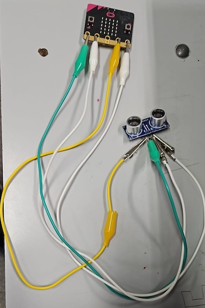

# Avance 1: Agosto 2025

## 6/8/2025

**Tareas completadas:** En esta clase se crea el equipo de trabajo y se plantean diferentes ideas para el proyecto:
1. Bastón inteligente
1. Monitoreo de humedad para sistema de irrigación
1. Sistema para medir el número de pasajeros en omnibus

Se elige el proyecto Bastón inteligente ya que cumple con los objetivos planteados para el proyecto de impacto, originalidad y replicabilidad.

Se crea la página web usando Google Sites por su facilidad de uso, flexibilidad y por permitir la colaboración entre los miembros del equipo.

**Problemas encontrados:** ninguno

**Proximos pasos:** crear listado de materiales

## 13/8/2025
**Tareas completadas:** Se realiza el listado de materiales para comenzar a trabajar:
- micro:bit v1
- Sensor de proximidad
  - Se comprará en Eneka:
    - https://www.electronica.uy/producto/robotica/sensores-robotica/posicion-¦-proximidad/modulo-sensor-de-distancias-srf05/
- Motor de vibración
  - Se utilizará un teléfono celular viejo para extraer la parte
- Speaker

Se investiga la manera de conectar el sensor de proximidad al micro:bit:
- Ultrasonic Distance Sensor with Python and the micro:bit
  - https://firialabs.com/blogs/lab-notes/ultrasonic-distance-sensor-with-python-and-the-micro-bit 
- Micro:bit Physical computing guides: No. 9: Ultrasonic sensor (HC-SR04 5v)
  - https://www.teachwithict.com/hcsr045v.html 
- Micro:bit & Ultrasonic Distance Sensor
  - https://www.youtube.com/watch?v=_nI336ZbHcQ 

**Problemas encontrados:** ninguno

**Proximos pasos:**
- Compra de materiales
- Programación del sensor de proximidad y motor de vibración

## 20/8/2025
**Tareas completadas:** Se adquieren los materiales y se comienza a programar el sensor de proximidad que detecta la distancia a la cual se encuentra un objeto mediante el envío de una señal que rebota en un obstáculo y lo capta nuevamente el receptor interpretándola y convirtiéndola en un valor legible para el humano el cual se imprime en la pantalla del micro:bit. La unidad de medición es centímetros con un rango que va de 4 a 60 cm.

**Problemas encontrados:** Se intenta también conectar el motor de vibración al micro:bit, con resultados negativos. Luego de hablar con el profesor e investigar al respecto se concluye que el voltaje (3.3V) y corriente de salida del micro:bit no son suficientes para el motor. Se plantea usar una fuente externa de energía y un transistor.

**Próximos pasos:** adquirir un protoboard, un transistor y probar el motor de vibración con una fuente externa.

## 27/8/2025
**Tareas completadas:** Se compra una tarjeta expansora para micro:bit, la cual incluye una salida de 5V que puede ser usada para controlar el motor de vibración. Luego de realizar unas pruebas se logra controlar el motor de vibración exitosamente.

Se comienza a integrar todo el sistema en el protoboard. Se usa una luz led para simular el speaker para no generar ruido que interfiera con otros compañeros durante clase.

**Problemas encontrados:** ninguno

**Próximos pasos:** finalizar el sistema en el protoboard y diseñar como se va a montar el sistema en un bastón. Para el bastón se usará un ducto como prototipo, ya que puede ser fácilmente cortado y modificado.