# Documentación Técnica

*Fecha: 10 de noviembre de 2024*

Este documento contiene la documentación técnica para el proyecto STEAM del curso **Laboratorio STEAM+** de la tecnicatura **Redes y Software** del **Instituto Superior Brazo Oriental** de **UTU** año 2024.

# Proyecto: Bastón interactivo para persona no vidente

## 1. Integrantes
- Juan Perez
- María García
- Nicolás 

## 2. Descripción
Este proyecto propone una solución mediante un bastón interactivo que que permita que personas con discapacidad visual puedan movilizarse de manera independiente y confiable.

Se creara un prototipo de bastón inteligente el cual ayudará al usuario a desplazarse de manera mas segura reaccionando a la proximidad de obstáculos mediante un sensor de proximidad el cual alerta al usuario mediante diferentes actuadores generando una vibración y alerta sonora indicando que se encuentra cerca de un obstáculo.

Las funcionalidades del prototipo se ajustarán y actualizarán dependiendo del tiempo empleado para la creación del mismo y los recursos que se necesiten para lograr nuevas funcionalidades con el medio.

## 3. Materiales
| Imagen       | Descripción |
| ------------ | ----------- |
| 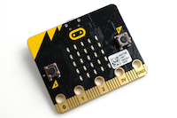 | micro:bit v1 |
| 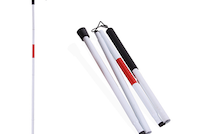 | Bastón |
| 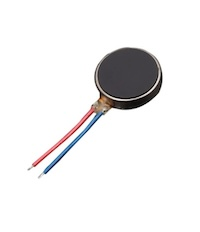 | Motor vibración |
| 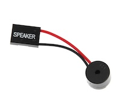 | Speaker |
| 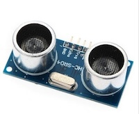 | Sensor de proximidad |
|  | Cables |
| 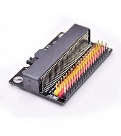 | Tarjeta expansora para micro:bit |
| 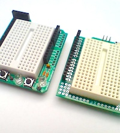 | Protoboard |
| 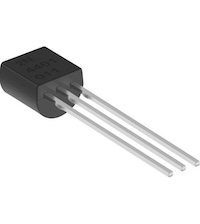 | Transistor NPN |
| 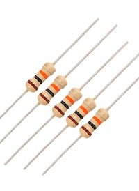 | Resistencia 220 ohmios |

## 4. Diseño Mecánico
Para realizar el ensamblaje del bastón interactivo se utilizó un ducto como prototipo del bastón, para reducir los costos y faciltar la realización de cortes para poder colocar y ensamblar los diferentes componentes electrónicos. Primero se colocó la tarjeta expansora de micro:bit la cual fue adherida al bastón y se realizo un pequeño corte para que los cables estuvieran por dentro del mismo. De igual manera se colocó el sensor de proximidad en el extremo inferior del bastón tal como se puede apreciar en las imagénes adjuntas.

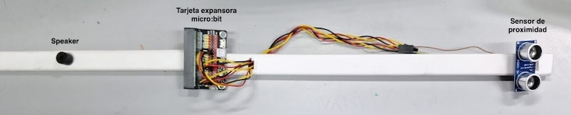

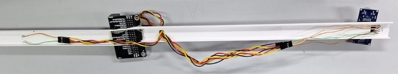

Por ultimo se añadió el speaker y el motor de vibración en el extremo superior del bastón para que estos estuvieran cerca de la persona y pueda percibir las alertas. El speaker se colocó por fuera con las conexiones por dentro para protegerlas y el motor vibrador se coloca adherido al bastón por dentro quedando oculto (este último no quedó capturado en las imagenes).

## 5. Diseño Electrónico
Se presenta el diagrama de conexión del bastón sensorial y se adjunta link al proyecto en la plataforma tinkercad utilizada para la creación del mismo:
https://www.tinkercad.com/things/iSKwzF3iiut-conexion-prototipo-baston

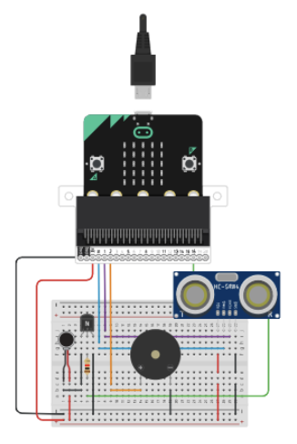

### Conexión de los pines del sensor de proximidad con el micro:bit
- VCC (Rojo)
   - Este pin es la alimentación del sensor y debe conectarse a una fuente de 5V o 3.3V (en este caso, la micro:bit provee 3V).
   - Proporciona la energía necesaria para que el sensor funcione.
- GND (Negro)
   - El pin de *tierra* o *ground*. Debe conectarse al GND del microcontrolador (en este caso, la micro:bit).
   - Completa el circuito de alimentación.
- Trig (Azul)
   - Es el pin de *activación*. Se conecta a un pin de salida digital de la micro:bit (en este caso, el **Pin 1*).
   - Cuando envías una señal de pulso corto (alrededor de 10 microsegundos) desde este pin, el sensor envía un "tren" de 8 ondas ultrasónicas.
- Echo (Verde)
   - Es el pin de *recepción*. Se conecta a un pin de entrada digital de la micro:bit (en este caso, el **Pin 0*).
   - El sensor mide el tiempo que tarda la onda ultrasónica en volver después de rebotar en un objeto. La micro:bit detecta el pulso de señal desde este pin y calcula el tiempo de viaje de ida y vuelta para determinar la distancia.

### Conexión del motor de vibración
- Transistor (NPN)
   - Se utiliza un transistor NPN (marcado con "N" en la parte superior).
   - El pin de colector (C) está conectado a un terminal del motor vibrador.
   - El pin de emisor (E) está conectado a tierra (GND).
   - El pin de base (B) está conectado a través de una resistencia al pin P0 del micro:bit.
- Motor vibrador
   - Un terminal del motor está conectado al colector del transistor.
   - El otro terminal del motor está conectado a la fuente de alimentación positiva (3V del micro:bit).
- Resistencia
   - Se coloca una resistencia entre el pin P0 del micro:bit y la base del transistor para limitar la corriente que fluye hacia la base del transistor.

### Conexión del speaker
- Speaker
   - El pin2 digital de la micro:bit está conectado a la fila de la protoboard para controlar la señal del speaker.
   - El pin positivo del zumbador (normalmente el más largo) está conectado a la fila de la protoboard donde llega la señal desde el pin digital de la micro:bit.
   - El pin negativo del zumbador está conectado a la fila de tierra (línea azul horizontal) de la protoboard.

## 6. Diseño Software
A continuación se presenta el código de Python utilizado para la programación de cada sensor y todo el prototipo en conjunto.

### Medición de la proximidad
Para medir la distancia con el sensor de proximidad o ultrasónico, se emite un pulso de 10 micro segundos y se mide el tiempo que tarda el receptor en recibir el pulso. Luego se aplica una fórmula matemática que nos determina la distancia aproximada en centímetros.

### Activación del speaker y motor de vibración
El speaker y el motor de vibración se activan con mayor o menor intensidad dependiendo de la distancia a la cual se detecta un obstáculo. Esto para que el usuario reciba gradualmente una estimulación auditiva y táctil conforme se aproxima al obstáculo. 

```python
from microbit import *
import time  # Importamos el módulo time para usar ticks_us()

parlante = pin2
motor_vibrador = pin16  # Cambiar el pin del motor vibrador a uno libre

def medir_distancia():
    # Definir los pines para el sensor
    trigger = pin1
    echo = pin0
   
    # Enviar un pulso al pin trigger para activar el sensor ultrasónico
    trigger.write_digital(0)
    time.sleep_us(2)  # Esperar 2 microsegundos
    trigger.write_digital(1)
    time.sleep_us(10)   # Pulso de 10 microsegundos
    trigger.write_digital(0)

    end_time = 0
    start_time = 0
   
    # Esperar a que el pin echo comience (cuando recibe el eco)
    while echo.read_digital() == 0:
        start_time = time.ticks_us()  # Tomar el tiempo cuando se envía el pulso
   
    # Esperar hasta que el pin echo termine (eco recibido)
    while echo.read_digital() == 1:
        end_time = time.ticks_us()  # Tomar el tiempo cuando se recibe el eco
   
    # Calcular la duración en microsegundos
    duration = end_time - start_time
   
    # Calcular la distancia en centímetros (velocidad del sonido = 34300 cm/s)
    distancia_cm = (duration / 2) / 29.1
   
    return distancia_cm

def sonar_parlante(distancia):
    # Control de errores: si la distancia es -1, no hacemos sonar el parlante
    if distancia == -1:
        parlante.write_digital(0)  # No emitir sonido si hay un error en la medición
        return
   
    # Establecer un intervalo en función de la distancia
    if distancia < 40:
        parlante.write_digital(1)  # Sonido constante
    elif distancia >= 40 and distancia < 80:
        intervalo = 50  
        for _ in range(5):  # Emitir sonido varias veces para mayor efecto
            parlante.write_digital(1)  # Activar el parlante
            sleep(20)  # Emitir el tono durante 20 ms
            parlante.write_digital(0)  # Apagar el parlante
            sleep(intervalo - 20)  # Esperar el tiempo restante
        else:
            parlante.write_digital(0)  # Sin sonido

def vibrar_motor(distancia):
    # Control de errores: si la distancia es -1, no activamos el motor
    if distancia == -1:
        motor_vibrador.write_digital(0)  # No vibrar si hay un error en la medición
        return
   
    # Establecer un intervalo de vibración en función de la distancia
    if distancia < 40:
        motor_vibrador.write_digital(1)  # Vibración constante
    elif distancia >= 40 and distancia < 80:
        intervalo = 50  
        for _ in range(5):  # Vibrar varias veces para mayor efecto
            motor_vibrador.write_digital(1)  # Activar vibración
            sleep(20)  # Vibrar durante 20 ms
            motor_vibrador.write_digital(0)  # Apagar vibración
            sleep(intervalo - 20)  # Esperar el tiempo restante
    else:
        motor_vibrador.write_digital(0)  # No vibrar si el objeto está lejos

# Bucle principal para medir continuamente
while True:
    distancia = medir_distancia()
   
    # Si la distancia es -1 (error), mostrar "ERR" en la pantalla
    if distancia == -1:
        display.scroll("ERR")
    else:
        # Mostrar la distancia solo si es un número válido y no es negativo
        if distancia >= 0:
            display.scroll(str(int(distancia)))  # Convertir a entero y luego a string para scroll
   
    sonar_parlante(distancia)  # Activar el parlante según la distancia
    vibrar_motor(distancia)  # Activar el motor vibrador según la distancia
    sleep(100)
```

## 7. Referencias y recursos
- Programación de micro:bit usando Python
  - https://python.microbit.org/v/3/reference
- Herramienta para diseño de circuitos Tikercad
  - https://www.tinkercad.com/
- Ultrasonic Distance Sensor with Python and the micro:bit
  - https://firialabs.com/blogs/lab-notes/ultrasonic-distance-sensor-with-python-and-the-micro-bit 
- Micro:bit Physical computing guides: No. 9: Ultrasonic sensor (HC-SR04 5v)
  - https://www.teachwithict.com/hcsr045v.html 
- Micro:bit & Ultrasonic Distance Sensor
  - https://www.youtube.com/watch?v=_nI336ZbHcQ 
- Microbit and a buzzer examples
  - http://www.microbitlearning.com/code/python/microbit-buzzer-examples.php 